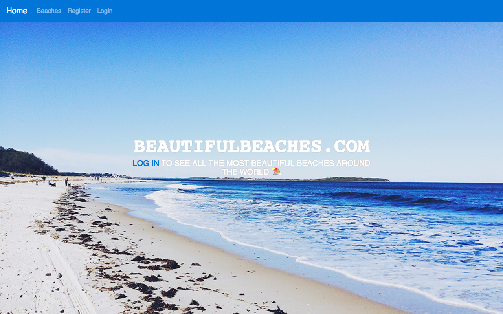
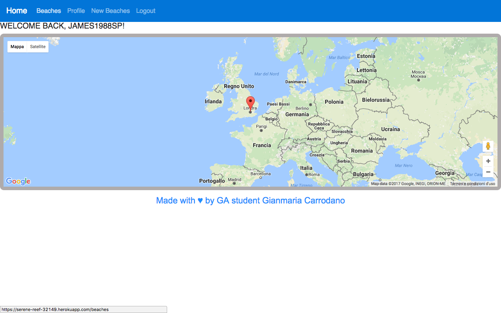

# GA WDI London - Project-2

# Beatifulbeaches.com
It can be viewed here: https://serene-reef-32149.herokuapp.com/
An application created for surfers, or for people who love spending time at the beach.

 

Once registered, and after Login, the User is redirect to a main map showing the various registered beaches inside the website.

The User can control the weather conditions in different beaches, temperature, humidity etc etc, thanks to the use of the Weather API.
In addition, the User is able to create a new beach, uploading images about it, and even modify the image of his profile.

# API :
Both the Google Maps API and the Weather API were consumed in the project.
Github Login.

# TECHNOLOGIES :

Bootstrap SCSS
Javascript
MongoDB
JSON
Gulp
NodeJS

# CHALLENGES : 
Consuming the Weather API took some time to mine for the correct data. Grab the correct data to display and create the beach view on the map.

# Extra features to include
Consume as many  APIs as possible to extend the info available to the User. Add some features to your profile page, such as the beaches that you created or visited by that user earlier, and maybe using another API to inform the user of some important events in the world's largest beaches.
